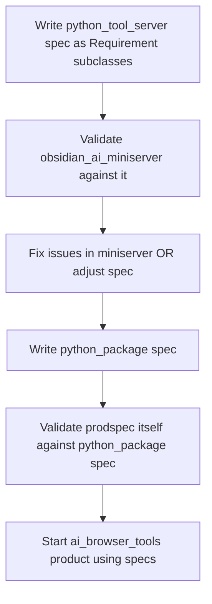

# Specreq: What's Next?

## Timeline Summary (May 4–17, 2026)

| Date | Key Activity |
|------|-------------|
| May 7 | Shipped `obsidian_ai_miniserver` v0.3.3 — spec-driven, publish script, auto-screenshots, 1700→350 prompt tokens. Called it "Factorio Lazy Bastard" moment. |
| May 8 | Added multi-vault support, headless Docker, web UI, merged MCP+OpenAPI under one port. |
| May 9 | Started thinking about reusable tool server spec — what's common vs product-specific. |
| May 11 | Deep design session on spec system: Product Spec vs Project Spec vs Project. Drafted markdown specs in Obsidian for Python Package, CLI, Server, WebUI, README, Git Repo. |
| May 12 | Continued spec design. Created `specs_dev` workspace. Debated file layout, composition, versioning. |
| May 13 | Realized markdown inheritance "doesn't go far enough" — pivoted to Python-first approach. Specs ARE Python packages that import each other. |
| May 16 | **Breakthrough.** Built the current `prodspec` framework: `Requirement` tree, `validate`/`_validate`, CLI `prodspec validate`, `--save`/`--strict`. 3 files, clean and working. |
| May 17 | Home maintenance day (Clarence the handyman). No coding. |

## What's Built

The `specreq` framework is real and functional:

- [`Requirement`](src/specreq/__init__.py:14) — generic tree node with Pydantic config, parent/children, validate lifecycle, exception survival, serialization
- [`specreq validate`](src/specreq/cli.py:53) — CLI that imports a spec module, discovers Requirement instances, validates a product directory
- 230 lines of tests covering trees, ordering, exception handling, serialization, multi-root
- Publish script, pyproject.toml, dev extras — production-grade packaging

## What's NOT Built

1. **No real specs exist yet** — the `specs/` directory is empty. No `python_tool_server` spec, no `python_package` spec, nothing.
2. **No products directory** — no output projects to validate against.
3. **The Obsidian drafts are markdown, not Python** — the project_specs folder has prose descriptions but no `Requirement` subclasses.
4. **No `prodspec create-product` or scaffolding** — the SPEC.md in Obsidian mentions this but it doesn't exist.
5. **No spec-to-product pipeline** — no way to generate a project from specs, only validate an existing one.

## Assessment

### The framework is ready. It's time to start building real projects with it.

The daily notes show a clear arc: you invented the concept, iterated through several designs, found the Python-first breakthrough, and built a clean minimal framework. The framework solves the core problem — composable, validatable specs as Python code.

What's missing isn't framework features. It's **the first real spec and the first real product built from it**. The May 16 note explicitly says:

> "Next: write the first real spec (`python_tool_server`) and validate against the existing miniserver."

That's still the right next step. The obsidian_ai_miniserver is a real, working product that was built from a prose spec. Converting that experience into a `python_tool_server` Requirement spec and validating the miniserver against it would prove the full cycle.

### Recommended Path

### Specific Steps

1. **Write `python_tool_server` spec** — Create `specs/python_tool_server.py` as `Requirement` subclasses that validate: FastAPI present, MCP routes, auth, config persistence, Docker compose, etc. Base it on the Obsidian drafts and the real miniserver code.

2. **Validate `obsidian_ai_miniserver` against it** — Run `specreq validate specs/python_tool_server.py ../obsidian_ai_miniserver`. This proves the cycle works end-to-end.

3. **Write `python_package` spec** — Validate `specreq` itself against it. Dogfooding.

4. **Start `ai_browser_tools`** — The May 9 and May 16 notes both mention this as the next product. Use the specs to drive its development.

### What NOT to Do

- **Don't add scaffolding commands yet** — `create-product`, `create-feature` etc. are premature. You don't know what templates you'd scaffold until you've built 2-3 products manually.
- **Don't add spec-to-code generation yet** — The AI can read specs and build projects. The framework validates the result. That's the loop. Code generation from specs is a later optimization.
- **Don't over-engineer the spec hierarchy** — Start flat. `python_tool_server` as one file. Split when you feel the pain, not before.
